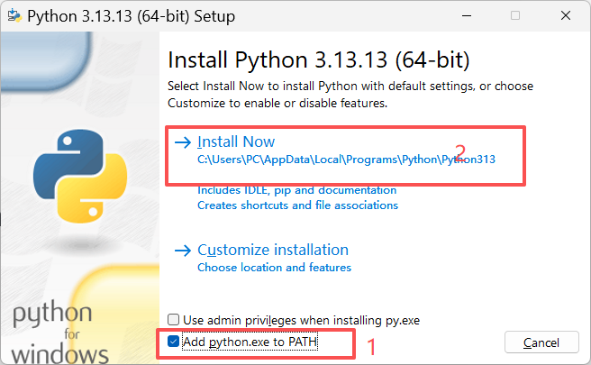
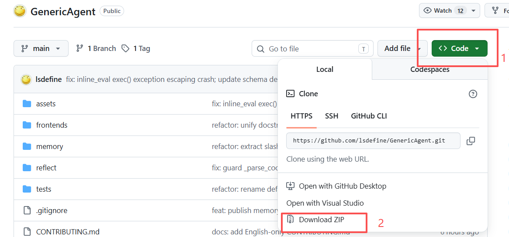
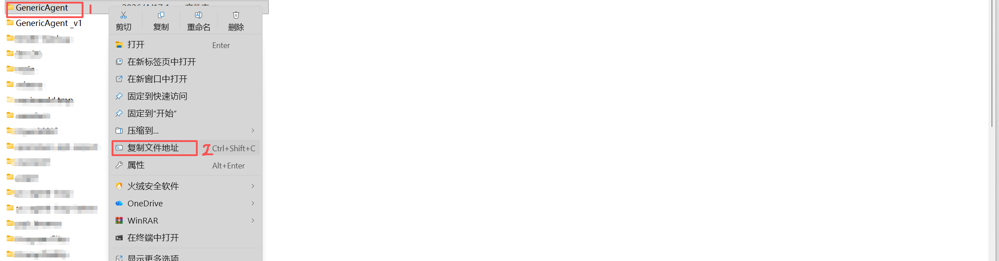
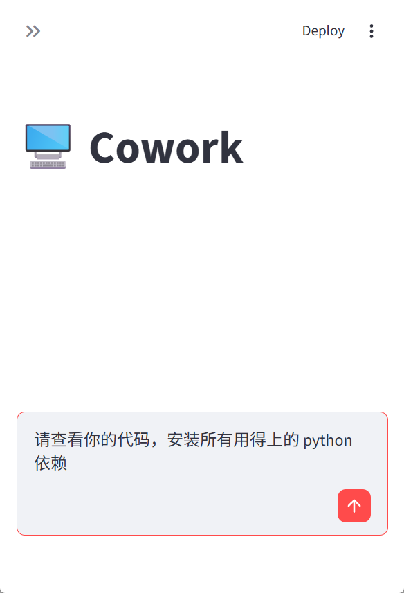
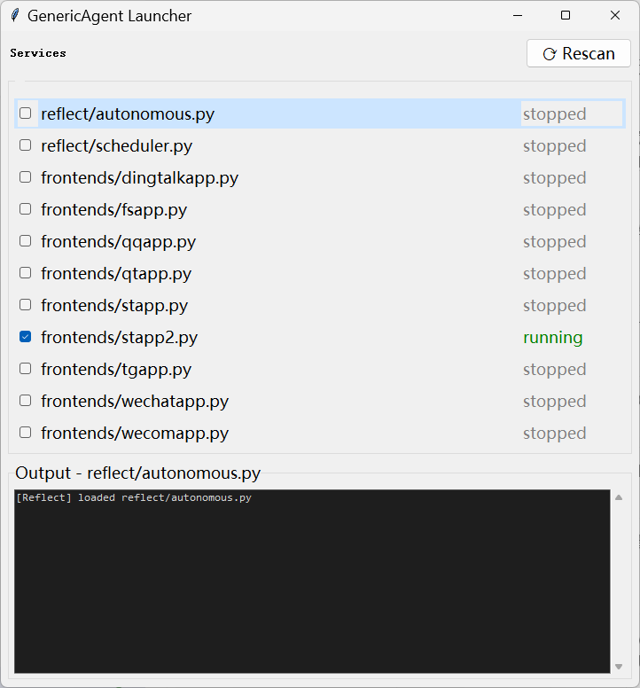

# 第 1 章 安装与环境配置

> **学完本章，你将拥有一个可以正常对话的 GenericAgent（GA）运行环境。**

## 🎯 学习目标

1. 在本地安装好 Python 并下载 GenericAgent 项目代码
2. 完成 `mykey.py` API 密钥配置，让 GA 能连接大模型
3. 成功启动 GA 并完成第一次对话

---

## 1.1 安装 Python

GA 依赖 Python 运行，我们先把它装好。

> ⚠️ 推荐 **Python 3.11 或 3.12**。不要使用 3.14（与 `pywebview` 等依赖不兼容）。

### Windows

1. 打开下载链接：https://www.python.org/ftp/python/3.12.10/python-3.12.10-amd64.exe
2. 运行安装包，**底部的 "Add python.exe to PATH" 一定要勾上**，然后点击安装

   
3. 验证安装：按 `Win + R` 输入 `cmd` 打开终端，输入：

   ```bash
   python3 --version
   ```

   看到 `Python 3.x.x` 就说明安装成功了。

### macOS / Linux

macOS 和大多数 Linux 发行版自带 Python 3，打开终端验证：

```bash
python3 --version
```

看到 `Python 3.x.x`（3.11 或 3.12）即可。如果版本低于 3.10，前往 [Python 官网](https://www.python.org/downloads/) 下载安装。

---

## 1.2 下载项目

我们需要把 GenericAgent 的代码下载到本地。两种方式任选其一：

**方式一：下载 ZIP（推荐新手）**

1. 打开 [GitHub 仓库页面](https://github.com/lsdefine/GenericAgent)
2. 点绿色 **Code** 按钮 → **Download ZIP**
3. 解压到你喜欢的位置（例如 `D:\GenericAgent`）

   

**方式二：Git Clone**

如果已经安装了 Git，在终端执行：

```bash
git clone https://github.com/lsdefine/GenericAgent.git
```

---

## 1.3 安装最小依赖

打开终端，进入项目目录(运行以下命令)，安装两个核心依赖：

```bash
# 1. cd 到下载的 GA 文件目录
cd d:     (如果你的安装地址在D盘，终端打开后默认在c盘,安装在c盘跳过此步骤)
cd "你的GenericAgent路径"（示例： cd D:/Document/GenericAgent-main） 

# 2. 安装最小环境依赖
pip install streamlit pywebview
```



> 💡 其余依赖不用手动装——1.5 节会教你让 GA 自己把剩余的包全装好。

---

## 1.4 配置 API 密钥（mykey.py）

GA 需要连接大模型才能工作。我们通过 `mykey.py` 告诉它用哪个模型、怎么连。

1. 进入项目文件夹，把 `mykey_template.py` 复制一份，重命名为 `mykey.py`
2. 用任意文本编辑器打开 `mykey.py`（缺解释），填入你的 API 信息。**选一种填就行**，不用的配置可以删掉或留着不管（填在哪？）

### 新手推荐配置：Claude 主力 + GPT 兜底

直接复制到 `mykey.py`，替换两个 `apikey` / `apibase`：

```python
# ── 主力：Claude Opus 4.6（CC switch 反代（Reverse Proxy），最常见）──
native_claude_config0 = {
    "name": "claude-main",
    "apikey": "sk-<你的 relay key>",
    "apibase": "https://<your-relay-host>/claude/office",
    "model": "claude-opus-4-6",
    "fake_cc_system_prompt": True,           # CC switch 必须 True
    "max_retries": 3,
    "read_timeout": 180,
}

# ── 备选：GPT-5.4 做兜底 ──
native_oai_config = {
    "name": "gpt-backup",
    "apikey": "sk-<你的 OpenAI key>",
    "apibase": "https://api.openai.com/v1",
    "model": "gpt-5.4",
    "reasoning_effort": "high",
    "max_retries": 3,
    "read_timeout": 120,
}

# ── Mixin 自动切换（Failover）──
mixin_config = {
    "llm_nos": ["claude-main", "gpt-backup"],
    "max_retries": 10,
    "base_delay": 0.5,
    "spring_back": 300,
}
```

<details>
<summary>📋 所有内置渠道一览（点击展开）</summary>

#### 一线直连渠道（填 apikey / apibase 即用）

| 渠道                 | 推荐变量名                     | apikey 形式 | apibase                                  | 示例 model                | 备注                              |
| -------------------- | ------------------------------ | ----------- | ---------------------------------------- | ------------------------- | --------------------------------- |
| Anthropic 官方       | native_claude_config_anthropic | sk-ant-xxx  | https://api.anthropic.com                | claude-opus-4-6[1m]       | sk-ant- 前缀自动切 x-api-key 鉴权 |
| OpenAI 官方          | native_oai_config              | sk-proj-xxx | https://api.openai.com/v1                | gpt-5.4                   | 支持 api_mode: 'responses'        |
| OpenRouter           | oai_config_openrouter          | sk-or-xxx   | https://openrouter.ai/api/v1             | anthropic/claude-opus-4-6 | model 用 provider/model 格式      |
| 智谱 GLM-5.1         | native_claude_glm_config       | xxx.yyy     | https://open.bigmodel.cn/api/anthropic   | glm-5.1                   | 推荐用 Anthropic 路径             |
| MiniMax（Anthropic） | native_claude_config_minimax   | sk-xxx      | https://api.minimaxi.com/anthropic       | MiniMax-M2.7              | 204K 上下文                       |
| MiniMax（OAI）       | oai_config_minimax             | sk-cp-xxx   | https://api.minimaxi.com/v1              | MiniMax-M2.7              | 回复带 think 标签                 |
| Moonshot / Kimi      | oai_config_kimi                | sk-xxx      | https://api.moonshot.cn/v1               | kimi-k2-turbo-preview     | 温度强制 1.0                      |
| DeepSeek             | oai_config_deepseek            | sk-xxx      | https://api.deepseek.com/v1              | deepseek-chat             | function calling 弱               |
| 阶跃星辰             | oai_config_stepfun             | xxx.yyy     | https://api.stepfun.com/v1               | step-2-16k                | OAI 兼容                          |
| 豆包 / 火山引擎      | oai_config_volcengine          | xxx-xxx     | https://ark.cn-beijing.volces.com/api/v3 | doubao-seed-1-8           | OAI 兼容                          |
| 硅基流动             | oai_config_siliconflow         | sk-xxx      | https://api.siliconflow.cn/v1            | deepseek-ai/DeepSeek-V3   | 新用户 16 元免费额度              |

#### 反代 / 透传类渠道（需要 `fake_cc_system_prompt = True`）

| 渠道类型            | 推荐变量名                     | apibase                        | 示例 model                | 备注                   |
| ------------------- | ------------------------------ | ------------------------------ | ------------------------- | ---------------------- |
| CC Switch（最常见） | native_claude_config0          | https://\<host\>/claude/office | claude-opus-4-6           | 多数中文低价站走此协议 |
| CRS 反代            | native_claude_config_crs       | https://\<host\>/api           | claude-opus-4-6[1m]       | CRS 官方协议           |
| AnyRouter           | native_claude_config_anyrouter | https://\<host\>/v1            | claude-opus-4-6           | 与 CC switch 同协议族  |
| Sider（订阅桥接）   | sider_cookie                   | 自动                           | gpt-5.4 / claude-opus-4-6 | 没有 API 时的兜底      |

#### 本地模型

| 方案      | 推荐变量名          | apibase                       | 示例 model        | 备注                    |
| --------- | ------------------- | ----------------------------- | ----------------- | ----------------------- |
| Ollama    | native_oai_ollama   | `http://127.0.0.1:11434/v1` | qwen2.5:14b       | 末尾 /v1 不能漏         |
| llama.cpp | oai_config_llamacpp | `http://127.0.0.1:8080/v1`  | default           | 建议走文本协议          |
| vLLM      | native_oai_vllm     | `http://127.0.0.1:8000/v1`  | 你 load 的模型 id | 需支持 function calling |
| LM Studio | oai_config_lmstudio | `http://localhost:1234/v1`  | LM Studio 模型 id | GUI 本地部署最省心      |

</details>

<details>
<summary>⚙️ 关键可调字段速查（点击展开）</summary>

| 字段                   | 默认             | 作用                             | 何时要改                    |
| ---------------------- | ---------------- | -------------------------------- | --------------------------- |
| name                   | 取 model         | 显示名 & mixin 引用名            | 有 mixin 时建议显式填       |
| apikey                 | ——             | 鉴权 Key                         | 必填                        |
| apibase                | ——             | API 端点地址                     | 必填                        |
| model                  | ——             | 模型名，后缀 [1m] 触发 1m 上下文 | 必填                        |
| fake_cc_system_prompt  | False            | 伪装 Claude Code CLI 指纹        | CC switch / CRS 必须 True   |
| api_mode               | chat_completions | 可选 responses                   | GPT-5.4 走 Responses API 时 |
| thinking_type          | adaptive         | adaptive / enabled / disabled    | 关思考用 disabled           |
| thinking_budget_tokens | ——             | 仅 enabled 生效                  | low≈4096 / high≈32768     |
| reasoning_effort       | ——             | none ~ xhigh                     | o 系列 / Responses API 支持 |
| temperature            | 1                | 采样温度                         | Kimi 强制 1.0               |
| max_tokens             | 8192             | 单次回复最大 token               | 长思考可提到 32768          |
| context_win            | 24000            | 历史裁剪阈值                     | 1m 上下文设 800000          |
| max_retries            | 1                | 自动退避重试次数                 | 不稳定渠道改 3              |
| connect_timeout        | 5                | 连接超时秒                       | 海外端点调大                |
| read_timeout           | 30               | 流式读取超时秒                   | 开思考须 180+               |
| stream                 | True             | 是否走 SSE 流式                  | CDN 截断时改 False          |
| proxy                  | ——             | 单 session 代理                  | 海外端点加代理              |

</details>

🔄 Mixin配置模式：允许GA在模型断开后自动切换模型

一次配好主 + 备 + 兜底，任何一个 429/5xx/超时都自动切下一个：

```python
mixin_config = {
    'llm_nos': ['claude-main', 'claude-backup', 'gpt-backup'],  # 按优先级
    'max_retries': 10,      # 整个 rotation 总重试上限
    'base_delay': 0.5,      # 秒，指数退避起始
    'spring_back': 300,     # 秒，切到备用后多久尝试回到主
}
```

**约束**：`llm_nos` 中的名字必须精确匹配到其他 config 的 `name` 字段；所有被引用的 session **必须同属** Native 系列（NativeClaude + NativeOAI 可混）或**全不属** Native 系列。


---

## 1.5 启动 GenericAgent

### 首次启动

在终端中执行：

```bash
# 1. cd 到项目目录
cd "你的GenericAgent路径"

# 2. 启动
python launch.pyw
```

> 看到浏览器弹出 Streamlit 聊天界面（或 pywebview 窗口），就说明启动成功了。如果用命令行模式 `python agentmain.py`，终端出现 `>>>` 提示符即为正常。

### 让 GA 自动安装剩余依赖

启动后，在对话框输入一句话，GA 会自己读代码、找出需要的包、全部装好：

```
请查看你的代码，安装所有用得上的 python 依赖
```



### 🛠️ 推荐：提升使用体验的两个任务

**建立 Git 连接**（方便以后更新代码）：

```
请帮我建立 git 连接，方便以后更新代码
```

GA 会自动配好。如果你电脑上没有 Git，它也会帮你下载 portable 版。

**创建桌面快捷方式**（以后双击图标就能启动）：

```
请帮我在桌面创建一个 launch.pyw 的快捷方式
```


### 使用 Hub 总控台（可选）

`hub.pyw` 是 GA 的总控台——一键启动/停止所有后台服务，并实时查看日志。

启动方式：在终端执行 `python3 hub.pyw`，或直接双击 `hub.pyw` 文件。勾选想启动的服务即可，不用记命令行参数。



<details>
<summary>📋 Hub 可管理的服务列表（点击展开）</summary>

| #  | 服务名                   | 角色                                  | 启动命令                                            |
| -- | ------------------------ | ------------------------------------- | --------------------------------------------------- |
| 1  | reflect/autonomous.py    | 自主行动反射器：30 分钟无输入自动触发 | python agentmain.py --reflect reflect/autonomous.py |
| 2  | reflect/scheduler.py     | 定时任务调度器 + L4 会话归档          | python agentmain.py --reflect reflect/scheduler.py  |
| 3  | frontends/dingtalkapp.py | 钉钉机器人                            | python frontends/dingtalkapp.py                     |
| 4  | frontends/fsapp.py       | 飞书 / Lark 机器人                    | python frontends/fsapp.py                           |
| 5  | frontends/qqapp.py       | QQ 开放平台机器人                     | python frontends/qqapp.py                           |
| 6  | frontends/qtapp.py       | PySide6 桌面悬浮球                    | python frontends/qtapp.py                           |
| 7  | frontends/stapp.py       | 默认 Streamlit Web UI                 | python -m streamlit run frontends/stapp.py          |
| 8  | frontends/stapp2.py      | Anthropic 风格 Streamlit UI           | python -m streamlit run frontends/stapp2.py         |
| 9  | frontends/tgapp.py       | Telegram 机器人                       | python frontends/tgapp.py                           |
| 10 | frontends/wechatapp.py   | 个人微信（首次扫码登录）              | python frontends/wechatapp.py                       |
| 11 | frontends/wecomapp.py    | 企业微信机器人                        | python frontends/wecomapp.py                        |

</details>


---

## 1.6 常见问题排查

<details>
<summary>❓ Windows 安装后闪退 / 重启后无法启动</summary>

**常见原因**（按发生概率）：

1. **Python 版本不对**：装了 3.14，`pywebview` / `streamlit` / `PySide6` 还没跟进
2. **Python 没加 PATH**：安装时 "Add Python to PATH" 没勾
3. **pip 依赖装了一半**：中途断网或关窗，导致包半装
4. **mykey.py 配置写错**：变量名冲突让整个模块 import 失败

**排查步骤**：

```powershell
# 1. 看 Python 版本（建议 3.11 或 3.12）
python --version

# 2. 手动起 agentmain 看报错
cd <你的 GenericAgent 目录>
python agentmain.py

# 3. 看 launch.pyw 报什么（改后缀为 .py 才能看 stderr）
python launch.py
```

**修复方法**：

1. 卸载 3.14，装 [Python 3.12](https://www.python.org/downloads/release/python-3128/)，安装时勾 Add Python to PATH
2. `mykey.py` 里**只保留一个启用的 config**，其他全部用 `#` 注释
3. 让 GA 自己补依赖（见 1.5 节"让 GA 自动安装剩余依赖"）

</details>

<details>
<summary>❓ pip 装完后不知道在哪运行 / 不知道 cd 到哪</summary>

`pip install` 装的是 Python 第三方包（依赖），**不是** GenericAgent 本体。GenericAgent 是一个 GitHub 仓库，必须手动下载 + 解压。

**正确步骤**：

1. 打开 https://github.com/lsdefine/GenericAgent
2. 绿色 Code 按钮 → Download ZIP
3. 解压到你喜欢的位置（例如 `D:\GenericAgent`）
4. 终端里 `cd D:\GenericAgent`
5. `python agentmain.py`

**永久解决**：让 GA 给你建桌面快捷方式（见 1.5 节折叠块"可选：让 GA 帮你做的事"），之后双击图标即可启动。

</details>

<details>
<summary>❓ DinTalClaw 懒人包和命令行安装有什么区别？</summary>

| 项目     | DinTalClaw 懒人包              | 命令行安装                     |
| -------- | ------------------------------ | ------------------------------ |
| 便利性   | 解压即用，内置 Python + 依赖   | 需装 Python、pip install       |
| 体积     | 约 500MB                       | 约 50MB 源码 + 按需依赖        |
| 版本     | 锁定某个 commit，可能落后      | 跟进最新 git                   |
| 自我升级 | 不能直接 git pull              | 可以 git pull 或让 GA 自己更新 |
| 修改源码 | 需手动找到解包后的 python 环境 | 改完即生效                     |

**建议**：想快速体验选懒人包；想长期用选命令行 + git clone。

</details>

<details>
<summary>❓ 能否支持 Win7？</summary>

**不能。** Python 3.9+ 已官方放弃 Win7，`pywebview` 依赖的 `WebView2` 也装不上。

**临时方案**：Win7 上用命令行模式 + Python 3.8，只跑 `agentmain.py`，不启 `launch.pyw`。但很多前端也跑不起来，**强烈建议升级到 Win10/11**。

</details>

<details>
<summary>❓ 怎样判断是否正常启动了？界面和别人的不一样</summary>

| 现象                                                       | 判定                          |
| ---------------------------------------------------------- | ----------------------------- |
| 命令行出现 `>>>` 提示符，敲字能触发 `[LLM Running...]` | ✅ CLI 正常                   |
| 浏览器 / pywebview 窗口出现 Streamlit 聊天界面             | ✅ GUI 正常                   |
| 终端一直没输出                                             | ❌ 卡在 import 或 mykey 配置  |
| 界面有但模型选择列表为空                                   | ⚠ mykey.py 没有可用 LLM 配置 |

"界面不一样"通常是两种 Streamlit 前端：`stapp.py`（默认界面）和 `stapp2.py`（Anthropic 风格浅色主题），二者均正常，选你喜欢的即可。

</details>

<details>
<summary>❓ 如何更新到最新版本？能让 GA 自己更新吗？</summary>

**能！** 两种方式：

**方式 A · 手动**：

```bash
cd <GenericAgent 目录>
git pull
```

若是 Download ZIP 安装的，没有 `.git` 目录，就到 GitHub 重新下 ZIP 覆盖。

**方式 B · 让 GA 自己更新**（推荐）：

```
请帮我建立 git 连接，方便以后更新代码
```

之后任何时候输入：

```
请 git 更新你的代码，然后看看 commit 有什么新功能
```

GA 会自己 `git pull` + 解读 commit log + 汇报给你。

</details>

<details>
<summary>❓ API mode 需要改成 responses 吗？</summary>

**默认 `chat_completions` 即可。** 只有两种情况改 `responses`：

1. 你用的是 OpenAI 官方 `/v1/responses` 端点且想传 `reasoning.effort` 结构化参数
2. 上游渠道只开了 Responses API 没开 chat/completions

```python
native_oai_config_responses = {
    ...
    'api_mode': 'responses',
    'reasoning_effort': 'high',
}
```

</details>

<details>
<summary>❓ API 繁忙 / 高峰期失败一次就停，能配重试吗？</summary>

**能**，两个层面：

- **单 session**：`'max_retries': 3`（默认 1），加大即可
- **多 session fallback**：用 `mixin_config` 的 `max_retries`（整个 rotation 总重试）

```python
native_claude_config = {
    ...
    'max_retries': 5,       # 429/5xx/超时自动退避重试
    'connect_timeout': 10,  # 连接超时 5 → 10 秒
    'read_timeout': 180,    # 流式读取 30 → 180 秒（思考模式必须加大）
}
```

</details>

<details>
<summary>❓ 接 API key 时需要配上下文长度吗？</summary>

**通常不需要。** 默认 `context_win=24000`（NativeClaude 默认 28000），这只是历史裁剪阈值，不是模型硬上限。

**什么时候要改**：

- 用 1M 上下文 Claude 时：`'model': 'claude-opus-4-6[1m]'` + `'context_win': 800000`
- MiniMax 204K：`'context_win': 100000`
- 本地小模型 8K：`'context_win': 6000`

</details>

---

### 相关文件速查

| 内容                       | 路径                    |
| -------------------------- | ----------------------- |
| API 密钥配置模板           | `mykey_template.py`   |
| API 密钥配置（你自己创建） | `mykey.py`            |
| 主启动脚本                 | `launch.pyw`          |
| 服务总控台                 | `hub.pyw`             |
| CLI 入口                   | `agentmain.py`        |
| 默认 Web UI                | `frontends/stapp.py`  |
| Anthropic 风格 Web UI      | `frontends/stapp2.py` |

---

## 📝 小结

- **环境三步走**：装 Python 3.11/3.12 → 下载项目 → `pip install streamlit pywebview`
- **配置只需一个文件**：复制 `mykey_template.py` 为 `mykey.py`，填好 apikey 和 apibase 即可
- **启动后让 GA 自己装剩余依赖**，不用手动折腾

---

[下一章：第 2 章 基础对话与任务](../chapter2/)
