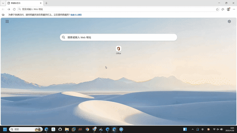
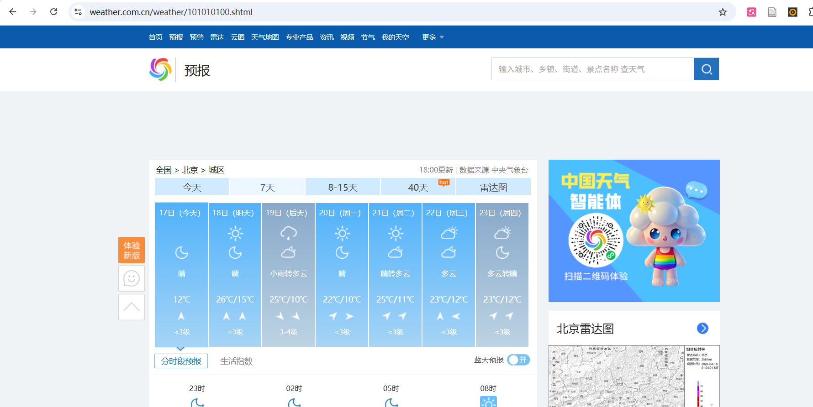
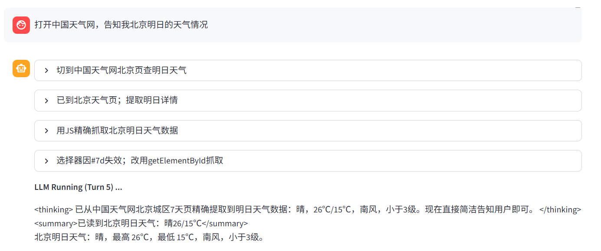
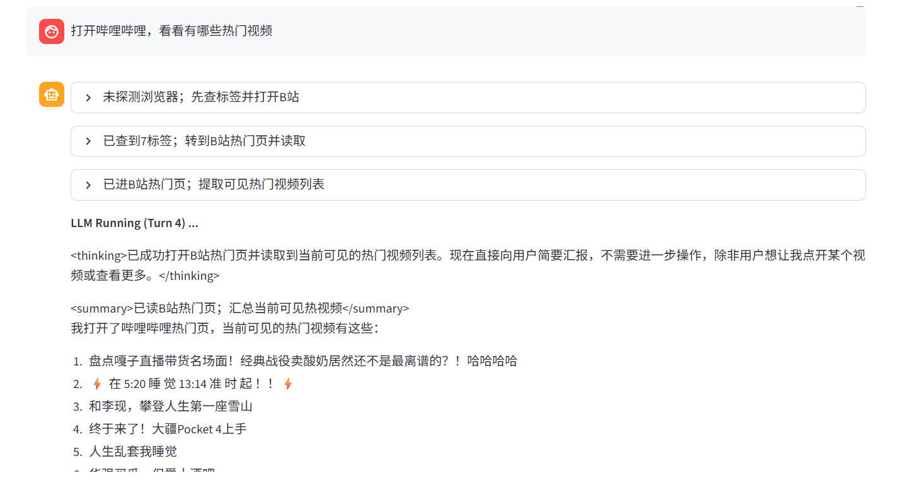
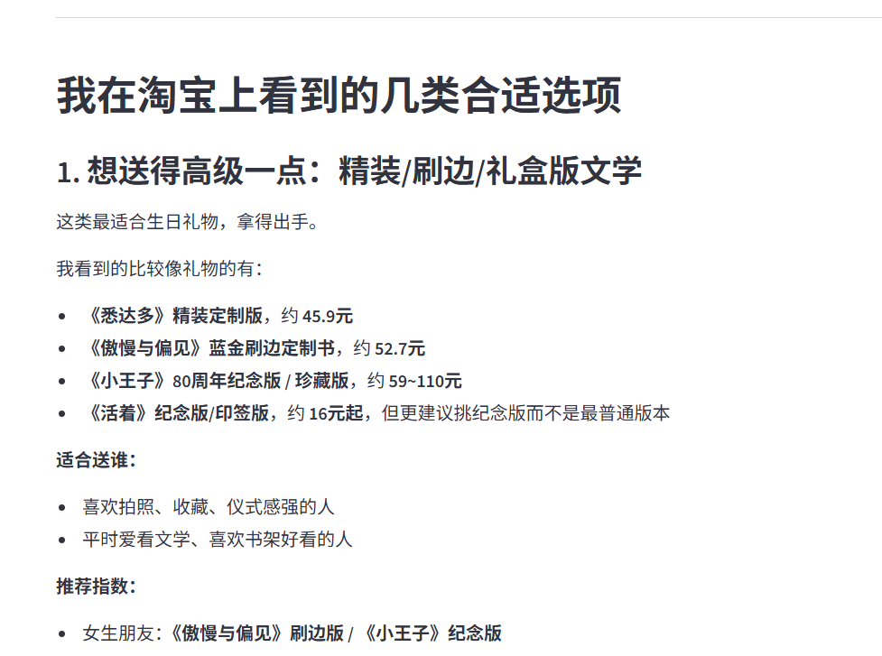
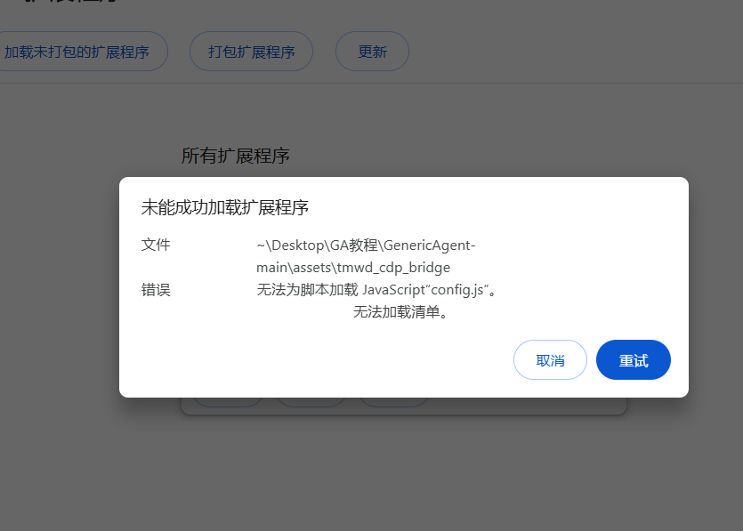

# 第 2 章 浏览器能力解锁

> **学完本章，GA 将能帮你操作一切在浏览器上的任务——像一个真正的"上网助手"。**

## 🎯 学习目标

1. 为浏览器安装 `tmwd_cdp_bridge` 插件，让 GA 获得网页操控能力
2. 验证插件安装成功，完成一次浏览器自动化操作
3. 知道 GA 在浏览器中能做什么、不能做什么（登录态、验证码等）

---

## 2.1 安装 tmwd_cdp_bridge 插件

GA 默认只能读写文件和执行代码。要让它操作浏览器，我们需要安装 **tmwd_cdp_bridge**——一个基于 CDP（Chrome DevTools Protocol）的浏览器扩展。

### 前置条件

- 已安装 **Chrome / Edge / 夸克** 中的任意一款浏览器
- 已下载 GA 项目源码，`GenericAgent-main/assets/tmwd_cdp_bridge/` 目录完整存在
- **已至少启动过一次 GA**（首次启动会生成插件所需的配置文件，否则安装会报错）

> ⚠️ **请勿移动或删除 `tmwd_cdp_bridge` 目录。** 插件采用"从文件夹加载"的方式安装，目录丢失或路径变更会导致插件失效。建议将 GA 项目放在稳定路径下（例如 `D:\GenericAgent`）。

三款浏览器的安装步骤大同小异，选择你正在使用的浏览器，按对应步骤操作即可。

---

### 2.1.1 Chrome 安装步骤

**第 1 步：打开扩展管理页并启用开发者模式**

在 Chrome 地址栏输入以下地址并回车：

```
chrome://extensions
```

页面 **右上角** 找到"开发者模式"开关，将其打开。


**第 2 步：加载插件**

打开资源管理器，定位到以下目录：

```
GenericAgent-main\assets\tmwd_cdp_bridge
```

将 **tmwd_cdp_bridge 整个文件夹** 直接拖入 Chrome 扩展管理页的空白处并释放。扩展列表中会出现 **TMWD CDP Bridge** 卡片，表示安装成功。

<details>
<summary>💡 拖拽无效？</summary>

也可以点击页面上的 **"加载已解压的扩展程序"** 按钮，在弹出的对话框中选择 `tmwd_cdp_bridge` 文件夹。两种方式等价。

</details>


---

### 2.1.2 Edge 安装步骤

Edge 与 Chrome 同属 Chromium 内核，步骤基本一致。

**第 1 步：打开扩展管理页并启用开发人员模式**

在 Edge 地址栏输入：

```
edge://extensions
```

扩展管理页 **左侧导航栏底部** 找到 **"开发人员模式"** 开关，将其打开。



**第 2 步：加载插件**

将 `GenericAgent-main\assets\tmwd_cdp_bridge` 整个文件夹拖入 Edge 扩展管理页窗口并释放，Edge 会自动完成安装。


---

### 2.1.3 夸克浏览器安装步骤

**第 1 步：打开扩展管理页并启用开发者模式**

在夸克地址栏输入：

```
quark://extensions
```

页面 **右上角** 找到 **"开发者模式"** 开关，将其打开。


**第 2 步：加载插件**

点击 **"加载已解压的扩展程序"**，在弹出的对话框中选中以下目录：

```
GenericAgent-main\assets\tmwd_cdp_bridge
```


---

## 2.2 验证安装

无论使用哪款浏览器，安装完成后的验证方式完全相同。回到 GA 对话界面，输入：

```
打开百度，搜索"今天天气"
```

如果浏览器自动打开百度并完成搜索，说明插件已正常工作 🎉

---

## 2.3 实战示例

插件就绪后，我们可以用自然语言让 GA 完成各种浏览器操作。以下是几个可直接运行的场景：

<details>
<summary><strong>示例 1：天气查询</strong></summary>

```
告知我北京明日的天气情况
```

GA 会自动打开天气网站，读取页面内容，把明日的温度与天气状况整理给你。



> 上图是 GA 正在操控浏览器抓取天气信息的过程。



> GA 读取完成后，会直接在对话中返回结构化的天气结果。

</details>

<details>
<summary><strong>示例 2：视频网站浏览</strong></summary>

```
打开哔哩哔哩，看看有哪些热门视频
```

GA 会打开 B 站热门榜，读取并整理当前热门视频信息。



> GA 汇总了热门视频的标题、播放量等关键信息，方便你快速了解当前热门内容。

</details>

<details>
<summary><strong>示例 3：购物网站商品推荐</strong></summary>

> 💡 使用前需先在浏览器中手动登录淘宝。

```
我想给好朋友送一本书作为生日礼物，请你打开淘宝看看并给我一些建议吧
```


GA 会打开淘宝搜索相关商品，并整理推荐结果：



</details>

---

## 2.4 常见问题

<details>
<summary><strong>Q1：安装插件时报错怎么办？</strong></summary>



在安装浏览器插件之前，必须先运行一遍 GA（见前置条件），否则会缺失配置文件。请回到第 1 章完成首次启动后再安装插件。

</details>

<details>
<summary><strong>Q2：GA 能否操作需要登录的网站？</strong></summary>

**可以，这也是该方案的核心优势之一。** 插件直接使用你本机的浏览器，凡是你已登录的站点，GA 均可直接访问，无需提供账号密码或 OAuth 令牌。

</details>

<details>
<summary><strong>Q3：篡改猴插件要不要装？</strong></summary>

**当前版本无需安装篡改猴**，直接使用 2.1 所述 `tmwd_cdp_bridge` 扩展即可。篡改猴方案仅在 CDP 插件无法使用的特殊环境下作为回退。

</details>

<details>
<summary><strong>Q4：GA 是否自带浏览器？必须额外安装吗？</strong></summary>

GA **不自带**浏览器。它通过 CDP（Chrome DevTools Protocol）扩展接管你本机已有的 Chrome / Edge / 夸克，沿用你的登录态与浏览器环境。这与 Selenium、Playwright 等启动独立浏览器实例的方案有本质差异。

</details>

<details>
<summary><strong>Q5：能否让 GA 绕过滑块验证码？</strong></summary>

**不建议尝试。** 这类人机校验依赖专用风控识别，GA 的 CDP 插件定位是"自动化已登录用户的正常操作"，并非破解工具。

</details>

<details>
<summary><strong>Q6：GA 能否自动登录网站？</strong></summary>

**不能，且不需要。** GA 使用的正是你自己的浏览器，因此需要你本人预先完成一次登录（扫码、输密码、二次验证等），此后浏览器会自行保留会话。

实际使用建议：

- **首次使用前**：先打开浏览器，手动登录好你希望 GA 操作的站点（淘宝、Gmail、飞书等）
- **登录过期后**：GA 访问时会看到登录页，此时暂停让你手动重新登录，完成后再继续
- GA **不会也不应**为你输入账号密码——这既涉及账号安全，也无法处理扫码、短信验证码等场景

</details>

<details>
<summary><strong>🔧 旧方案：篡改猴（Tampermonkey）安装指南</strong></summary>

在 CDP 插件推出之前，GA 采用的是 **篡改猴 + 用户脚本** 方案。目前该方案已不再推荐，主要原因：

- 安装流程较长（安装篡改猴 → 开启"允许用户脚本" → 调整 CSP 设置 → 安装脚本）
- 受浏览器 `isTrusted` 机制限制，部分按钮点击、文件上传等操作无法完成
- 官方已明确将在后续版本中逐步移除该方案

**以下情况仍可能需要旧方案：**

- GA 版本较旧，`assets/` 目录下仅有 `ljq_web_driver.user.js` 而无 `tmwd_cdp_bridge/`——建议升级至最新版本
- 特殊环境下 CDP 插件不可用（例如企业设备禁用了 Chrome 的 debugger 权限）

**回退步骤：** 向 GA 发送以下指令：

```
执行 web setup sop，解锁 web 工具（按篡改猴方案）
```

GA 将读取 `memory/web_setup_sop.md` 并引导完成篡改猴的安装与配置。

> ℹ️ 同名指令 `执行 web setup sop，解锁 web 工具` 在当前版本下默认采用 CDP 插件方案。如需走旧方案，请在指令中附加"按篡改猴方案"。

</details>

---

## 📂 相关文件速查

| 内容                       | 路径                                         |
| -------------------------- | -------------------------------------------- |
| CDP 浏览器桥接插件目录（**勿删勿移**） | `assets/tmwd_cdp_bridge/`       |
| 旧版篡改猴用户脚本（仅回退时使用）           | `assets/ljq_web_driver.user.js` |
| 浏览器配置 SOP（GA 内部参考）                | `memory/web_setup_sop.md`       |

---

## 📝 小结

- **一个插件解锁浏览器能力**：将 `tmwd_cdp_bridge` 文件夹拖入浏览器扩展页即可完成安装
- **GA 使用你自己的浏览器**：已登录的站点无需重复登录，GA 直接复用你的会话
- **验证方式**：让 GA 执行一次搜索，浏览器自动响应即表示成功

---

[上一章：第 1 章 安装与环境配置](../chapter1/)
