# 第 3 章 基础使用：第一个小时

> **学完本章，你将熟悉 GA 的界面、解锁视觉与文件搜索等扩展能力，并掌握多轮对话技巧。**

## 🎯 学习目标

1. 熟悉 GA 的交互界面，能自如地与 GA 对话
2. 解锁 OCR、视觉、飞书 CLI、Everything CLI 四大扩展能力
3. 掌握多轮对话与上下文管理的最佳实践

---

## 3.1 界面介绍

双击 `launch.pyw` 启动 GA 后，我们会看到一个简洁的对话界面：

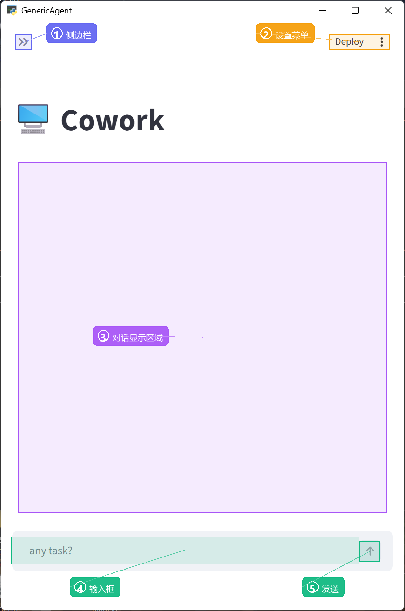

界面主要由以下几个区域组成：

**❶ 模型选择区**

左上角下拉菜单，用于切换当前使用的大语言模型（LLM）。如果我们在 `mykey.py` 中配置了多个模型，可以在这里自由切换。

**❷ 轮次计数器**

显示当前任务已经进行了多少轮对话。每一轮代表 GA 的一次"思考→工具调用→获得结果"的循环。

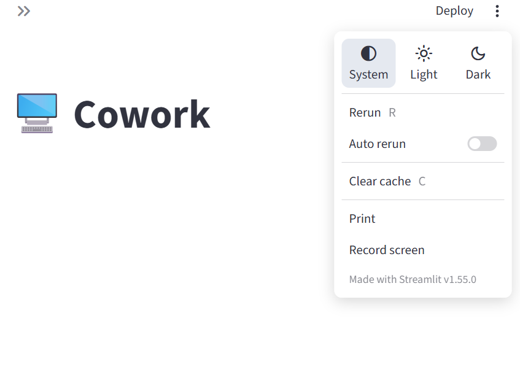

<details>
<summary>💡 关于轮次的更多细节</summary>

每一轮都可以展开查看详细过程。如果 GA 在一轮中调用了多个工具，我们可以展开查看每个工具的输入和输出。

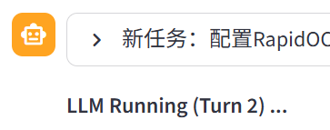

</details>

**❸ 对话显示区**

GA 的回复和工具调用结果都会显示在这里。多轮任务会自动折叠成可展开的摘要，避免历史信息过长。

**❹ 输入框**

在这里输入指令或问题，用自然语言描述即可。支持多行输入（Shift+Enter 换行），按 Enter 发送。

**❺ 发送按钮**

点击输入框右侧的上箭头按钮，或直接按 Enter 键发送消息。

> ⚠️ **小提示**：如果 GA 正在执行任务，会看到光标闪烁（▌），表示正在生成回复。如果离开超过 30 分钟且开启了"自主行动"，GA 会自动执行预设的自动化任务。

---

## 3.2 视觉能力

GA 由大语言模型驱动，本身不具备视觉能力。但通过配置 OCR 和视觉扩展，我们可以让 GA "看见"屏幕和图片。

### 3.2.1 OCR 能力

OCR（光学字符识别）能让 GA 阅读图片上的文字。配置非常简单，只需一句话：

> 用 rapidocr 配置你的 ocr 能力并存入记忆

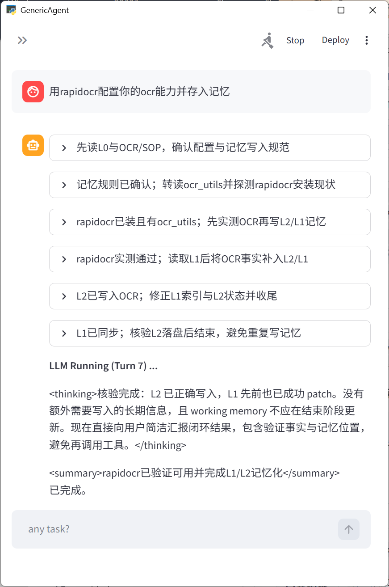

配置完成后，GA 就能阅读任何图片上的文字了：

> 帮我看看 `F:\data\to_be_ocred.png` 这张图片写了什么

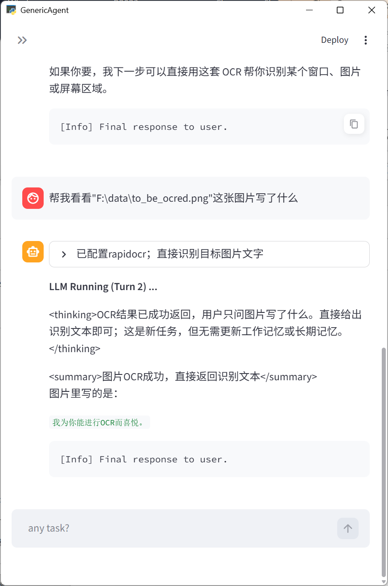

更实用的是，配置了 OCR 之后，GA 可以了解我们的屏幕内容：

> 总结我当前屏幕上的内容

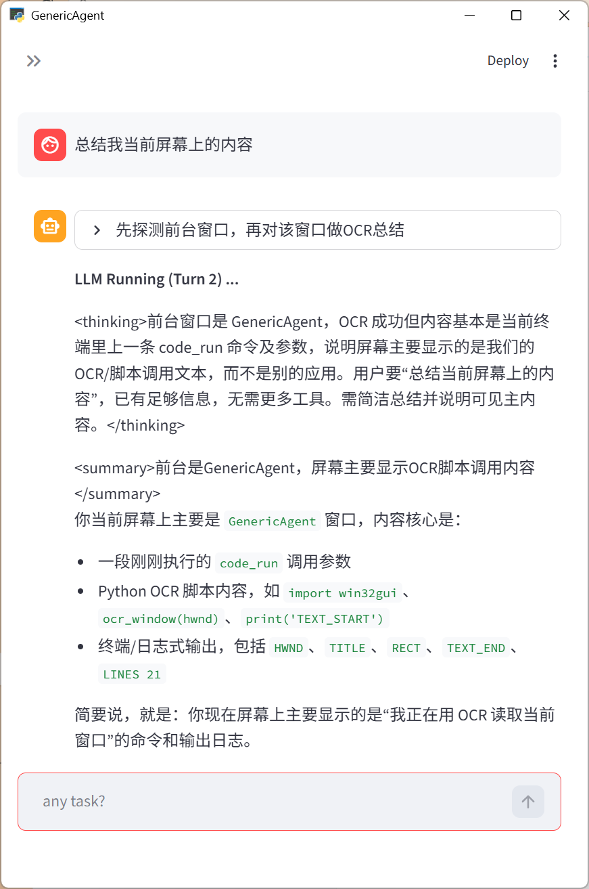

### 3.2.2 视觉能力（Vision）

OCR 只能识别文字。如果需要 GA 理解界面布局、识别图标和窗口，我们还需要解锁完整的视觉能力：

> 仿照你的 llmcore，写个调用 vision 的能力并存入记忆

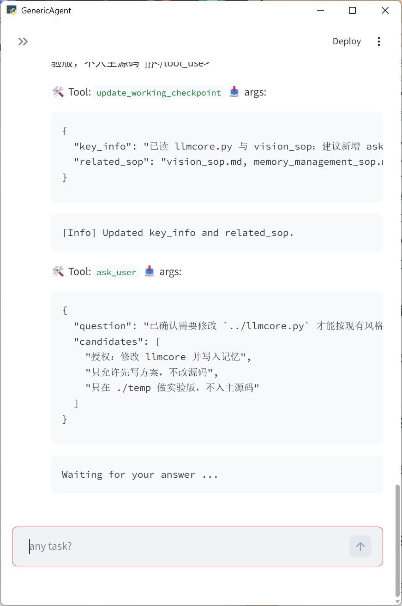

GA 会请求修改自身代码的授权。由于我们确实希望它获得视觉能力，回复授权即可。

> ⚠️ GA 在申请授权时给出的选项可能不完全一致——这些选项是 GA 自己生成的，并非固定程序。我们可以复制选项发送，也可以用自然语言表达意图。

配置完成后，测试一下：

> 请看看我的屏幕上有哪些应用、窗口和重要组件

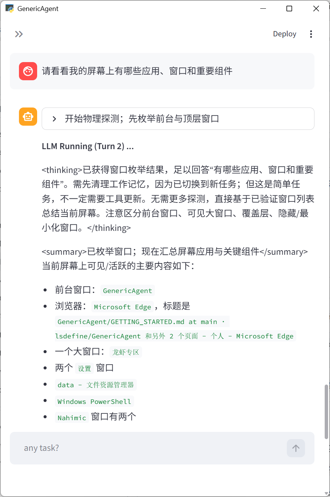

现在 GA 已经拥有完整的视觉能力，可以理解屏幕上的窗口和内容了。

---

## 3.3 飞书 CLI

通过飞书 CLI（lark-cli），GA 不仅能收发飞书消息，还能直接操作日历、云文档、多维表格、邮箱、任务、审批等 22 个飞书功能模块——相当于给 GA 装了一个飞书全能遥控器。

> 💡 飞书 CLI 和 [第 5 章](../chapter5/) 介绍的飞书 Bot 是两件事：Bot 让你在飞书聊天窗口给 GA 发消息；CLI 让 GA 主动操作你的飞书数据（日历、文档、邮件等）。两者可以同时使用。

<details>
<summary>💡 飞书 CLI 能做什么</summary>

- 日历操作（查看日程、创建会议、查询忙闲）
- 文档操作（创建/读取/更新云文档、搜索文档）
- 多维表格（创建表格、增删改查记录、数据分析）
- 电子表格（读写 Excel、导出数据）
- 任务管理（创建任务、分配成员、设置提醒）
- 邮箱操作（发送邮件、搜索邮件、管理草稿）
- 会议纪要（查询会议记录、获取 AI 总结）
- 审批流程（查询审批、同意/拒绝审批）
- OKR 管理、知识库管理、考勤打卡查询等

</details>

### 安装飞书 CLI

向 GA 发送：

```
安装并配置飞书 CLI（lark-cli），使其可以通过 code_run 调用
```

GA 会自动完成安装：


安装完成后，还需要配置 App 凭证和用户授权，GA 会一步步引导你完成。

<details>
<summary><strong>配置 App 凭证与用户授权（点击展开完整流程）</strong></summary>

**配置 App 凭证**

GA 会要求提供飞书应用的 App ID 和 App Secret（获取方式见 [第 5 章 飞书接入指引](../chapter5/)）。


如果你已经在 `mykey.py` 中配置过飞书凭证，可以直接告诉 GA：`直接读取我在 mykey.py 中配置的 App ID 和 App Secret`。

否则按 GA 提示，选择安全输入方式：

```
提供 App ID + 手动输入 App Secret
```


向 GA 发送你的 App ID（请替换为你的实际值）：

```
app_id: 'cli_xxxxxx' 品牌:feishu
```


GA 会打开一个命令行窗口，将你的 App Secret 粘贴进去并回车：

<table><tr>
<td></td>
<td></td>
</tr></table>

看到 OK 后，告诉 GA：`已输入 Secret 并回车`

<table><tr>
<td></td>
<td></td>
</tr></table>

**授权用户登录**

App 凭证只能操作应用级功能。要让 GA 访问你的个人数据（日历、邮件、任务等），还需要完成用户授权：

```
弹出浏览器授权页面，我来给你授权
```


浏览器会弹出飞书授权页面，确认授权即可：

<table><tr>
<td></td>
<td></td>
</tr></table>

授权完成后回到 GA，回复：`已授权`


</details>

### 效果验证

配置完成，试一下：

```
帮我看看明天的飞书日程
```


日程查看、文档整理、任务创建等操作都可以直接用自然语言告诉 GA，无需手动输入 CLI 命令。

---

## 3.4 Everything CLI（Windows 文件搜索）

> Everything CLI 是 Windows 平台的极速文件搜索工具，能在毫秒级时间内搜索整个硬盘。配置后，GA 可以快速定位任何文件，无需遍历目录。

### 为什么需要它？

当我们让 GA 读取一个文件时，如果不提供完整路径，GA 可能无法定位。Everything CLI 为 GA 提供毫秒级全盘搜索能力，彻底解决这个问题。

<details>
<summary>💡 没有 Everything 时的表现</summary>

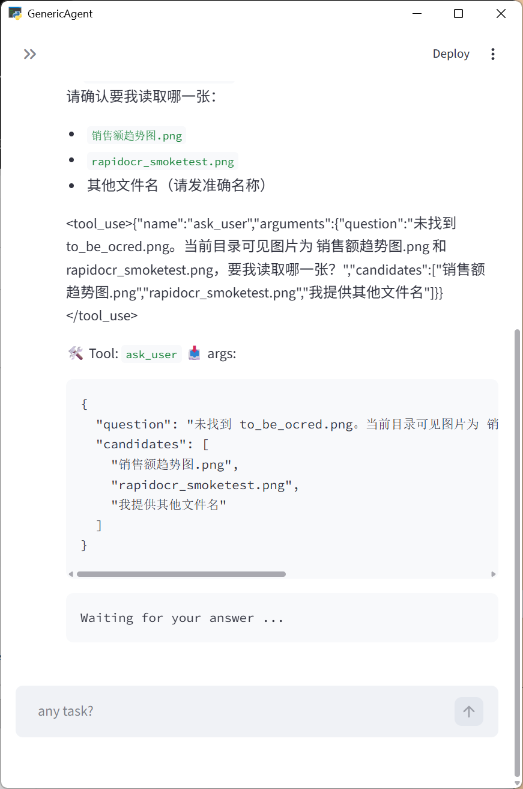

</details>

### 安装配置

向 GA 发送：

> 安装并配置 Everything 命令行工具进 PATH

> ⚠️ 安装过程中，系统可能弹出管理员权限请求窗口（有时藏在任务栏后台），请注意查看并授权。

<details>
<summary>💡 安装过程截图</summary>

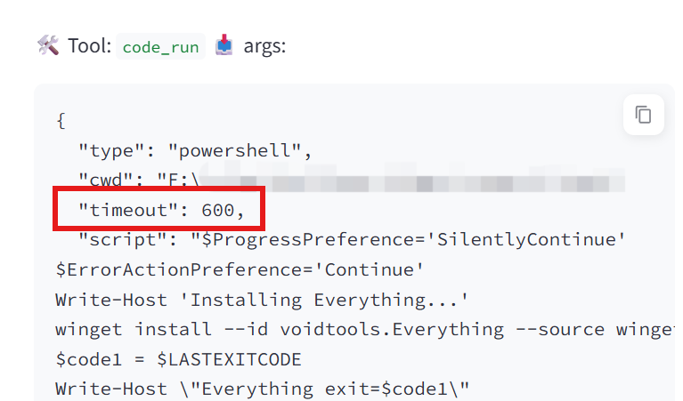

安装完成后，GA 会确认配置成功：

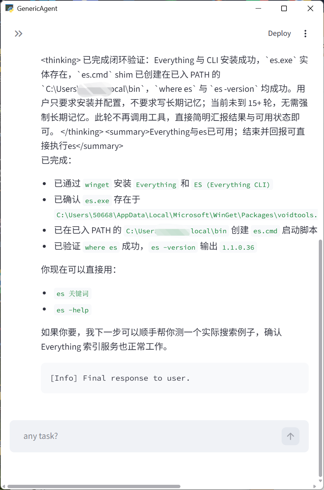

</details>

<details>
<summary>💡 安装后的建议</summary>

- 如果电脑管家提示 Everything 想要开机自启，请允许（不会明显拖慢启动）
- 建议重启电脑以确保 Everything 服务生效
- 可以让 GA 把这个习惯写入记忆：「写入 L1，任何大规模文件查询直接使用 es」

</details>

### 效果验证

再次让 GA 查找文件，这次指定使用 es 搜索：

> 请读取 to_be_ocred.png 里面的文字，使用 es 全盘搜索这个文件

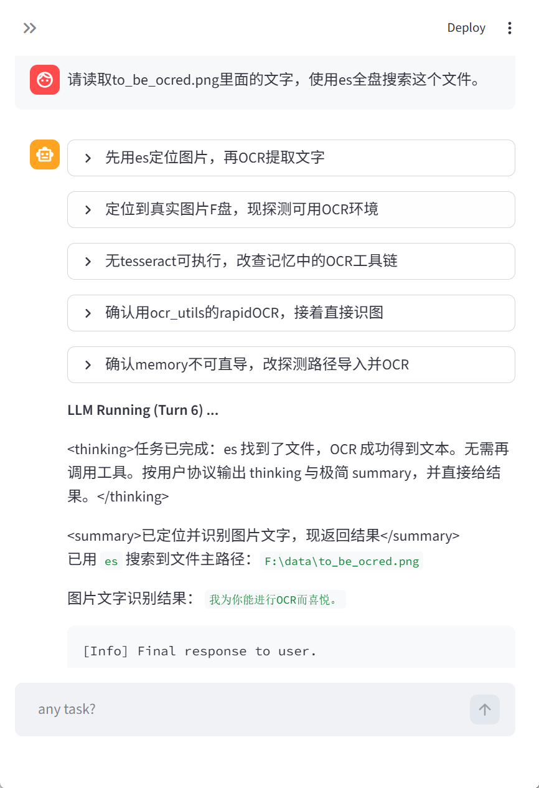

GA 仅用 1 轮就定位到了文件路径，效率显著提升。

---

### 什么是"最佳实践"

走到这里，你已经为 GA 解锁了视觉、飞书 CLI、Everything CLI 三项扩展能力。但这只是 GA 能力的冰山一角——我们不可能替你穷举所有场景，因为一千个人眼里有一千个哈姆雷特，每个人的任务、偏好和工作流都不一样。

所谓最佳实践，不是一套固定的操作手册，而是一个使用习惯：

1. **把需求告诉 GA**——用你自己的话描述，不需要措辞精确
2. **执行过程中敢于打断**——发现方向不对就喊停，给出你的思路和判断
3. **成功后让 GA 沉淀记忆**——好的经验只需教一次，GA 会永久记住

保持这个习惯，你的 GA 就会越用越懂你，越用越强。所以，现在就打开电脑试起来——你的实践，就是最佳实践。

---

## 3.5 多轮对话与上下文

GA 不是一次性工具，而是可以连续对话的助手。它会记住之前说过的话，理解上下文。

### 3.5.1 / 命令（快捷指令）

在对话框中，我们可以直接输入以 `/` 开头的快捷指令来控制 GA 的行为，无需用自然语言描述。以下是目前支持的全部 / 命令：

| 命令 | 作用 | 说明 |
|---|---|---|
| `/help` | 显示帮助 | 列出所有可用的 / 命令 |
| `/status` | 查看状态 | 显示 GA 当前是否正在运行，以及正在使用哪个 LLM |
| `/stop` | 停止当前任务 | 立即中断正在执行的任务，GA 会停止所有工具调用 |
| `/new` | 清空当前上下文 | 开始一个全新的对话，清除所有历史记录 |
| `/restore` | 恢复上次对话 | 直接从日志文件恢复最近一次的对话历史（聊天平台使用） |
| `/resume` | 恢复历史对话（可选择） | GA 浏览最近几次对话的结尾摘要，让你选择恢复哪一次（GUI 桌面窗口使用） |
| `/llm [n]` | 查看或切换模型 | 不带参数：列出所有已配置的模型；带编号：切换到指定模型 |

<details>
<summary>💡 各平台对 / 命令的支持情况</summary>

`/restore` 和 `/resume` 都能恢复历史对话，但入口不同：

- `/restore` 在**聊天平台前端**（飞书、钉钉、QQ、Telegram、企业微信）中实现，直接从日志文件加载上次的对话记录
- `/resume` 在 **GUI 桌面窗口**中实现，GA 会列出最近几次对话的摘要让你选择，然后以选中的对话为基础继续聊天

| 前端 | 支持的命令 |
|---|---|
| GUI 桌面窗口 | `/resume`、`/llm`（部分命令有对应按钮，如停止按钮 = `/stop`） |
| 飞书、钉钉、QQ、Telegram、企业微信 | `/help`、`/status`、`/stop`、`/new`、`/restore`、`/llm` |
| 微信 | `/stop`、`/llm` |

</details>

**使用示例**：

1. **切换模型**：如果当前模型响应太慢，可以快速切换

   ```
   /llm          ← 列出所有可用模型
   /llm 2        ← 切换到 2 号模型
   ```

2. **恢复历史对话**：重启 GA 后想继续之前的任务

   ```
   /resume       ← （GUI 桌面窗口）列出最近几次对话摘要，选择后恢复
   /restore      ← （聊天平台）直接恢复最近一次的对话历史
   ```

3. **紧急停止**：GA 执行了不符合预期的操作

   ```
   /stop         ← 立即中断，GA 停止当前所有操作
   ```

> ⚠️ **注意**：`/restore` 恢复的是最近一次的对话历史（保存在 `temp/model_responses/` 下的日志文件中）。恢复后 GA 只是获得了之前的上下文，我们需要输入新的问题来继续工作。

### 3.5.2 什么时候需要开新会话？

| 情况 | 说明 |
|---|---|
| 切换完全不同的任务 | 从数据分析切换到浏览器操作 → 建议 `/new` 或重启 |
| 对话太长导致"忘事" | 上下文窗口满了，GA 开始遗忘早期内容 → `/new` 开新会话 |
| 想要重新开始 | 之前尝试失败想换思路 → `/new` 清空后重来 |

> 💡 **开新会话方法**：输入 `/new` 即可清空上下文，无需重启 GA。当然，关闭窗口重新启动也可以。

### 3.5.3 上下文管理技巧

1. **明确指代**：说"帮我处理刚才那个 Excel 文件"比"帮我处理一下"好得多
2. **分步确认**：复杂任务分成多步，每步确认后再继续
3. **利用记忆**：常用偏好可以让 GA 记住——"以后处理销售数据时，都用这个格式"，GA 会写入记忆系统，下次自动应用
4. **善用 `/restore`**：意外关闭 GA 后，用 `/restore` 恢复上下文，无缝继续

---

## 3.6 常见问题

<details>
<summary><strong>Q1: GA 说"文件不存在"，但文件明明在？</strong></summary>

**可能原因**：GA 错误识别了目录，或当前工作目录与我们的认知不一致。

**解决方法**：
1. 使用绝对路径（包含盘符的完整路径）
2. 右键文件 →「复制为路径」→ 粘贴到输入框
3. 先告诉 GA 文件位置，再让它操作

</details>

<details>
<summary><strong>Q2: 代码运行结果不对？</strong></summary>

**解决方法**：直接告诉 GA「结果不对，我预期的是 XXX」。GA 会自己 debug 并修复。

**示例**：
- 👧：帮我统计每个月的销售额
- 🤖：[返回结果]
- 👧：不对，应该是按自然月统计，不是按 30 天
- 🤖：[重新计算，返回正确结果]

</details>

<details>
<summary><strong>Q3: 对话太长，GA 开始"忘事"？</strong></summary>

**解决方法**：
1. 让 GA 把关键信息写入工作记忆：「请将 xxx 写入 working_checkpoint」
2. 让 GA 把重要偏好写入长期记忆：「记住这个设置，以后都用」
3. 开新会话后让 GA 读取历史：「我们上次聊了什么？」

</details>

<details>
<summary><strong>Q4: GA 安装依赖失败？</strong></summary>

**解决方法**：
1. 检查网络连接，确保可以访问外网
2. 如果有代理，确保代理设置正确
3. 尝试手动安装：`pip install 包名`
4. 告诉 GA：「继续安装剩余的依赖」

</details>

<details>
<summary><strong>Q5: 浏览器控制不生效？</strong></summary>

**解决方法**：
1. 重新执行：「执行 web setup sop 解锁 web 工具」
2. 检查浏览器扩展管理页面，确认插件已启用
3. 确保浏览器是最新版本

</details>

<details>
<summary><strong>Q6: GA 响应很慢？</strong></summary>

**解决方法**：
1. 切换到更快的模型（如果配置了多个）
2. 把复杂任务拆分成多个简单任务
3. 检查网络连接质量

</details>

<details>
<summary><strong>Q7: 如何让 GA 记住我的偏好？</strong></summary>

明确告诉 GA「记住这个设置」或「以后都这样做」，GA 会把偏好写入记忆系统，下次自动应用。

**示例**：
- 👧：以后分析数据时，都用柱状图，不要用折线图
- 🤖：好的，我会记住这个偏好

</details>

---

<details>
<summary><strong>📂 相关文件速查</strong></summary>

| 内容 | 路径 |
|---|---|
| GA 启动入口 | `launch.pyw` |
| API 密钥配置 | `mykey.py` |
| GA 记忆存储目录 | `memory/` |

</details>

---

## 📝 小结

- **界面简洁**：GA 是自然语言交互助手，输入框打字即可使用
- **扩展能力**：OCR → 视觉 → 飞书 CLI → Everything CLI，每个都是一句话配置，永久提升 GA 表现
- **/ 命令**：`/stop` `/new` `/restore` `/resume` `/llm` 等快捷指令，高效控制 GA
- **对话技巧**：明确指代、分步确认、善用记忆，让 GA 越用越懂你

---

[上一章：第 2 章 浏览器能力解锁](../chapter2/) | [下一章：第 4 章 记忆与 Skill 系统](../chapter4/)
